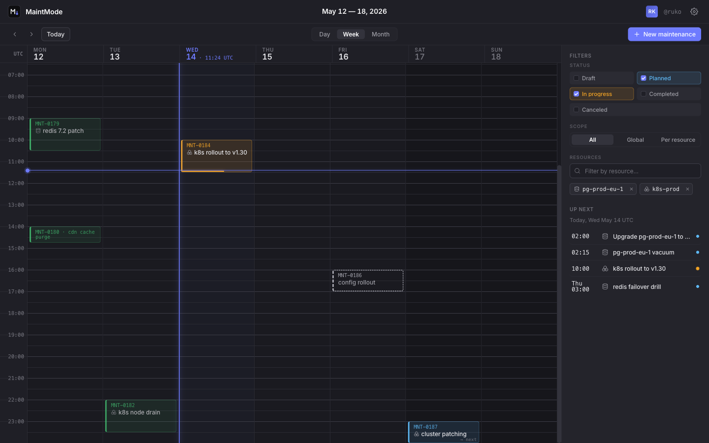
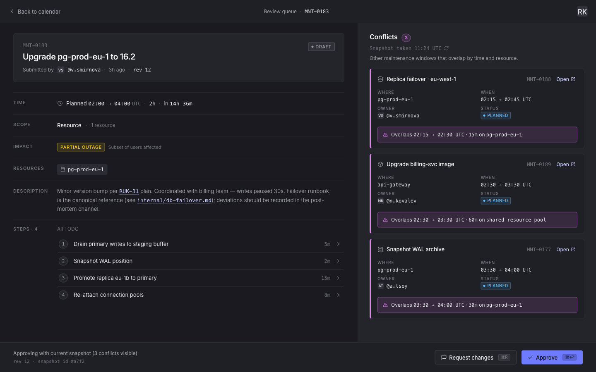

# MaintMode

**Maintenance calendar for engineering teams.** Plan technical work without
collisions and without surprise incidents.

Several teams share the same infrastructure. Two changes touch the same database
in overlapping windows, nobody notices, and something breaks. MaintMode makes
that visible beforehand:

> **Time + shared resources = risk.**

One calendar of maintenance work. Which resources each piece of work touches.
What was *planned* versus what actually *happened*. Overlaps flagged as
conflicts before they turn into incidents.

Conflicts are the point: when a new window overlaps an existing one on a shared
resource, you see it while the work is still a draft — not after the incident.

## Repositories

| | |
|---|---|
| [**maintmode**](https://github.com/maintmode-dev/maintmode) | Backend — Go service, PostgreSQL, the API |
| [**maintmode-ui**](https://github.com/maintmode-dev/maintmode-ui) | Frontend — Next.js |
| [**maintmode-selfhost**](https://github.com/maintmode-dev/maintmode-selfhost) | Docker Compose setup and installation guide |

## Running it yourself

Self-hosting is free and unlimited — no seat counting, no licence check, no
telemetry. Start at
[maintmode-selfhost](https://github.com/maintmode-dev/maintmode-selfhost).

A hosted option, priced per seat, is what pays for the work. The code is the
same either way.

Everything here is [AGPL-3.0](https://www.gnu.org/licenses/agpl-3.0.html).
